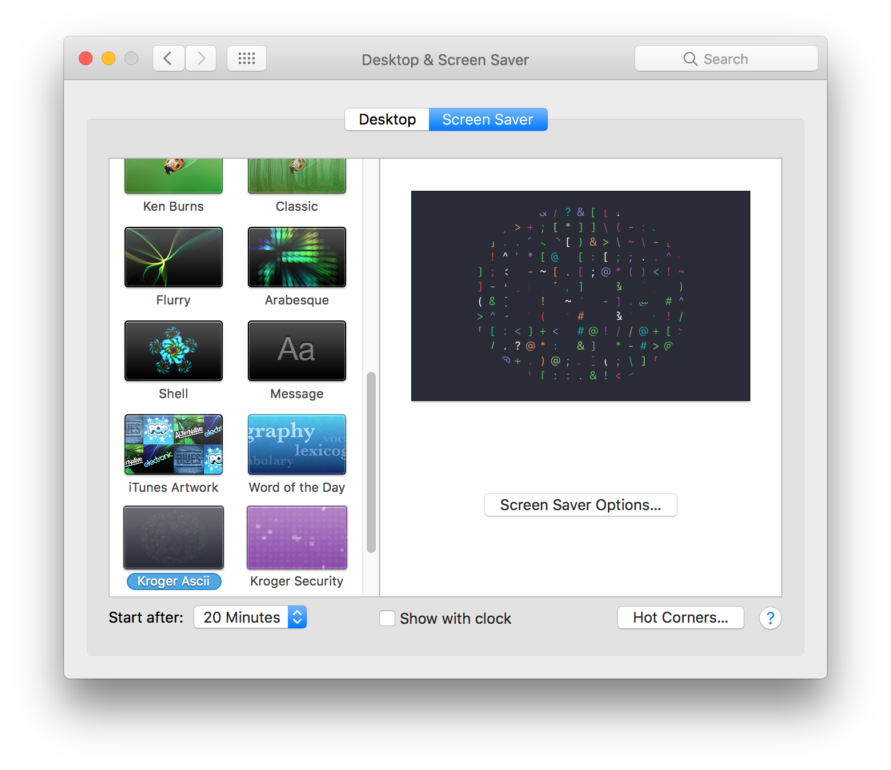

# SwiftScreenSaverTemplate

## Overview

**SwiftScreenSaverTemplate** is a MacOS screen saver written in Swift.  The example HTML content is based upon octoscreen, referenced in the [acknowledgements](#acknowledgements) section below.  This screen saver template provides the following features:

- Embedded HTML based screen saver

## Screenshots

System Preferences - Screen Saver



Screen Saver - Animation


## Customizing

Replace the instance of "NewSwiftScreenSaverProject" in the first command below with your desired project name.

```sh
$ export newProjectName="NewSwiftScreenSaverProject"
$ git clone https://github.com/burnsra/SwiftScreenSaverTemplate.git "$newProjectName"
$ cd "$newProjectName"
$ git mv SwiftScreenSaverTemplate "$newProjectName"
$ git mv SwiftScreenSaverTemplate.xcodeproj "$newProjectName".xcodeproj
$ find README.md "$newProjectName" "$newProjectName".xcodeproj -path "*Assets.xcassets*" -prune -o -type f -print0 | xargs -0 sed -i "" "s/SwiftScreenSaverTemplate/$newProjectName/g"
$ git add -A
$ git commit -m "Renamed template screen saver project to "$newProjectName
$ unset newProjectName
```

## Acknowledgements

- [octoscreen](https://github.com/orderedlist/octoscreen/) by [Steve Smith (orderedlist)](steve@github.com)

## Contributions

Do you want to improve the app or add any useful features? Please go ahead and create pull requests. I'm thankful for any help.

## License

[MIT](https://github.com/burnsra/SwiftScreenSaverTemplate/blob/master/LICENSE) © Robert Burns
