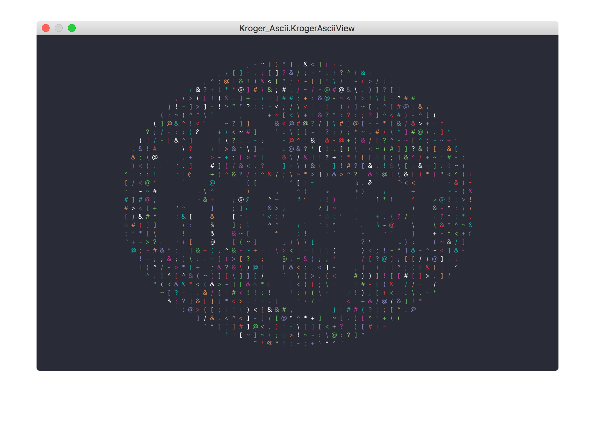

# Kroger Ascii

## Overview

**Kroger Ascii** is a MacOS screen saver written in Swift.  This screen saver template provides the following features:

- Embedded HTML based screen saver

## Screenshots

System Preferences - Screen Saver

Screen Saver - Screenshot

## Acknowledgements

- [icomoon](https://icomoon.io/) by [Roonas](http://roonas.com/)
- [octoscreen](https://github.com/orderedlist/octoscreen/) by [Steve Smith (orderedlist)](steve@github.com)

## Contributions

Do you want to improve the app or add any useful features? Please go ahead and create pull requests. I'm thankful for any help.

## License

[MIT](https://github.com/burnsra/KrogerAsciiScreenSaver/blob/master/LICENSE) © Robert Burns
